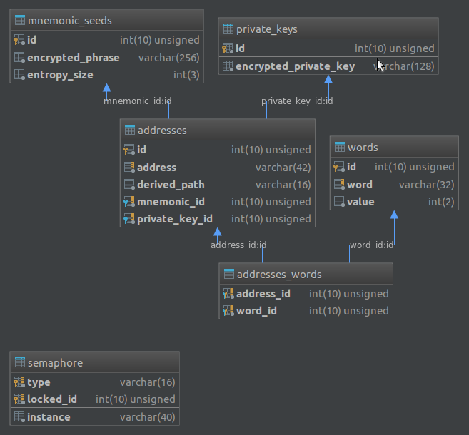

# Bitcoin Trezor Vanity Address

Generate Bitcoin vanity address for i.a. Trezor hardware wallet. 

Addresses are generated into the MySQL database, and you can search for the desired address using SQL query. The database also stores mnemonic seeds (for the addresses collection) and private keys for individual addresses. 

You can use external MySQL database because private data are encrypted using AES-256. By default, the script generates the first 5 addresses in the BIP44 (1...) and BIP49 (3...) format for each seed phrase.

For more info see the [BIP39](https://github.com/bitcoin/bips/blob/master/bip-0039.mediawiki), [BIP44](https://github.com/bitcoin/bips/blob/master/bip-0044.mediawiki), [BIP49](https://github.com/bitcoin/bips/blob/master/bip-0049.mediawiki) spec. 

In addition, the project includes a script that allows you to categorize addresses based on the contents of words from the dictionary.

## Requirements

Project require PHP >= 7.1 (extensions `php-cli`, `php-mysql`,`php-gmp`, `php-bcmath`), MySQL database access and [Composer](https://getcomposer.org/) dependency manager.


## Setup

1. Clone repository:
    ```bash
    git clone git@github.com:borutainfo/BitcoinTrezorVanityAddress.git
    ```

2. Create `database.yml` and `encryption.yml` based on `*.example` files located in directory `config/`, and set database access data and AES encryption passphrase.

3. Install composer dependencies:
    ```bash
    composer install
    ```

4. Execute SQL queries from [ddl.sql](ddl.sql) file, in your database, to create data structure.

## Runing generation script

To start addresses generating, execute:

```bash
php bin/GenerateVanityAddress.php
```

The addresses will appear in the database that you can search using the sql query e.g.

```sql
SELECT * FROM addresses WHERE address LIKE '%boruta%';
```

By default script is working for 2 minutes (you can change easily change this in `bin/GenerateVanityAddress.php` file). You can run multiple instances in parallel, and put the script in the crontab (for default config: `*/2 * * * *`).

## Runing dictionary search

To start dictionary search of generated addresses, execute:

```bash
php bin/RateAddressValue.php
```

By default during `composer install` there are downloaded dictionaries for English and Polish languages. You can remove, or add new dictionary files in `config/dictionaries/` directory.

The script will iterate individual addresses and check the occurrence of words from the dictionary, and then add relevant information to the database.

This script also works for 2 minutes by default. You can run multiple processes at the same time because they are synchronized.

## Private key / seed phrase decryption

To decrypt data, copy the encrypted data from the `addresses` or `mnemonic_seeds` table (depending on what you want to decrypt), and paste it to `bin/DecryptData.php` in place of `1234567890_SOME_ENCRYPTE_DATA`. 

Then execute the following command:

```bash
php bin/DecryptData.php
```

As a result, you will receive decrypted data. You can import decrypted seed phrase into your Trezor using the restore option, or import private key to full node wallet.


## Database structure

The structure of the database is intuitive and contains foreign keys so moving around it should not be problem. 



Use [ddl.sql](ddl.sql) to create structure.